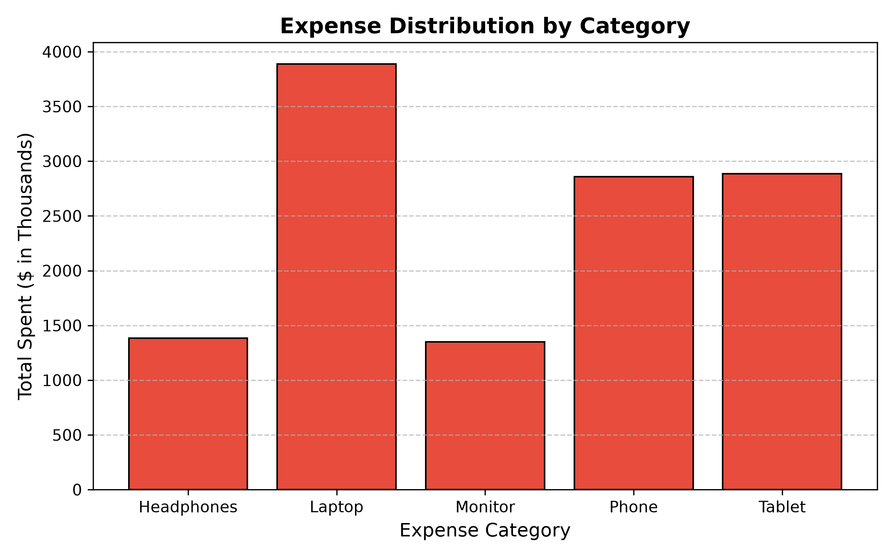
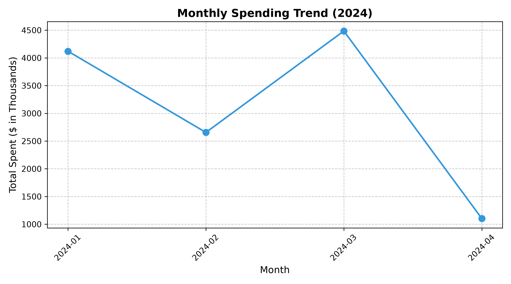
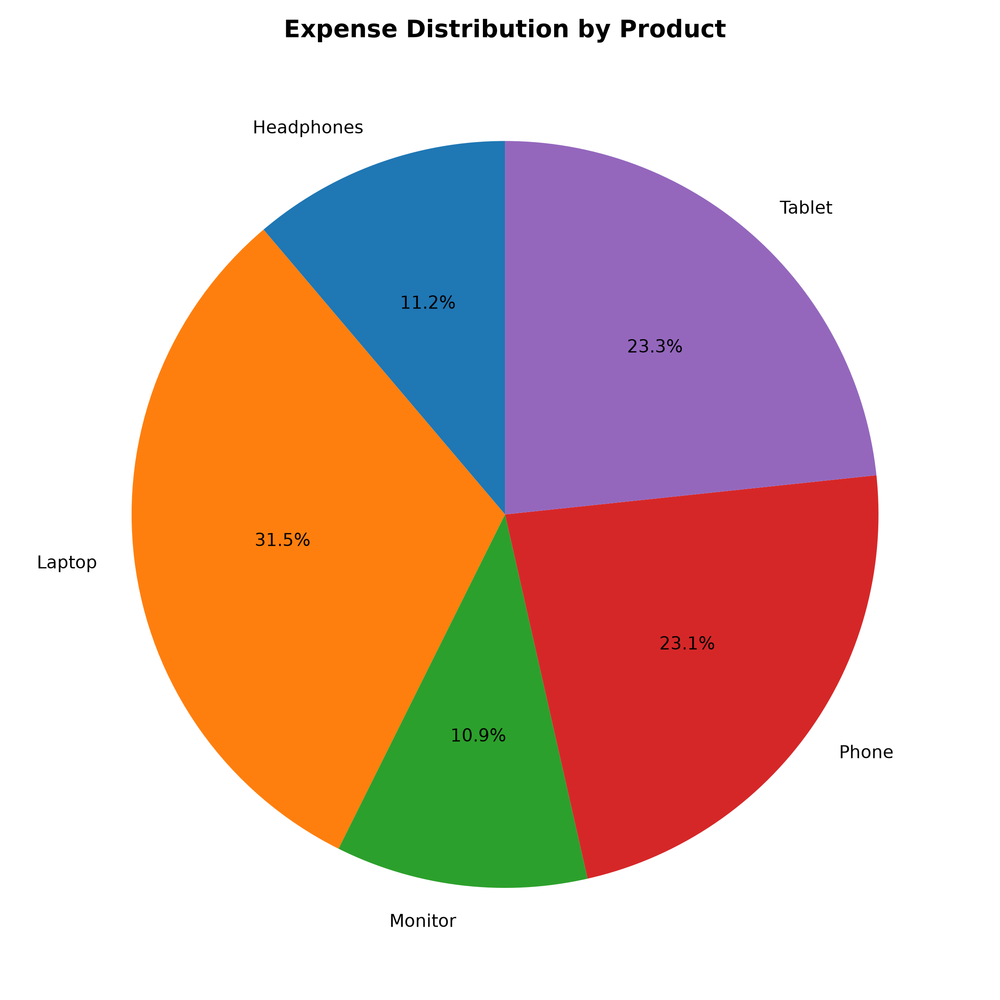

# Personal Expense Tracker & Analysis

## 1. Introduction

The **Personal Expense Tracker & Analysis** project is a Python-based data analysis and visualization project developed as part of the **Week 4: Data Visualization & Your First Complete Project**.

The purpose of this project is to analyze transaction and expense data using Python. The project loads a CSV dataset, checks and cleans the data, validates sales calculations, calculates important expense metrics, creates visualizations, and generates useful insights.

The project demonstrates a complete basic data analysis workflow using **Python, Pandas, and Matplotlib**.

## 2. Project Objectives

The main objectives of this project are:

- Load transaction data using Python.
- Understand the structure and size of the dataset.
- Check the dataset for missing values.
- Clean and validate the data.
- Convert transaction dates into the correct date format.
- Validate the Total Sales values.
- Calculate the total amount spent.
- Calculate the total number of items purchased.
- Calculate the average expense per transaction.
- Identify the highest-spending product.
- Identify the lowest-spending product.
- Identify the month with the highest spending.
- Create meaningful data visualizations.
- Generate useful insights from the transaction data.

## 3. Dataset Description

The project uses a CSV dataset containing transaction information.

The dataset contains **100 records** and includes the following columns:

| Column | Description |
|---|---|
| Date | Date on which the transaction occurred |
| Product | Name of the product purchased |
| Quantity | Number of items purchased |
| Price | Price of each item |
| Total Sales | Total amount spent on the transaction |

The dataset is used to analyze product-wise and monthly spending patterns.

## 4. Tools and Technologies Used

The following tools and technologies were used:

- **Python:** Used as the main programming language for loading, processing, analyzing, and visualizing the data.
- **Pandas:** Used for reading the CSV dataset, checking data structure, handling missing values, converting dates, performing calculations, and grouping data.
- **Matplotlib:** Used to create bar charts, line charts, and pie charts.

## 5. Project Methodology

The project follows a step-by-step data analysis process.

### Step 1: Load the Dataset

The CSV dataset is loaded into Python using the Pandas library. The transaction data is stored in a Pandas DataFrame.

### Step 2: Check Dataset Shape

The shape of the dataset is checked to understand the number of rows and columns.

The dataset contains **100 records and 7 columns**.

### Step 3: Check for Missing Values

The dataset is checked for empty or missing values.

The analysis found **0 missing values**.

### Step 4: Convert Date Values

The Date column is converted into the proper date format. This allows the program to perform time-based analysis such as monthly spending analysis.

### Step 5: Validate Total Sales

The Total Sales column is checked to make sure that the values are correct.

The expected sales amount is calculated using:

**Total Sales = Quantity × Price**

The calculated value is compared with the existing Total Sales value.

### Step 6: Calculate Expense Metrics

The program calculates important expense-related metrics such as:

- Total amount spent
- Total items purchased
- Average expense per transaction
- Highest spending product
- Lowest spending product
- Highest spending month

### Step 7: Analyze Spending by Product

The transaction data is grouped according to the product. This helps determine which product has the highest and lowest spending.

### Step 8: Analyze Monthly Spending

The transaction data is grouped by month. Monthly spending is calculated to identify spending trends and determine the month with the highest spending.

### Step 9: Create Data Visualizations

Three different charts are created to present the analysis visually:

- Bar chart
- Line chart
- Pie chart

### Step 10: Generate Key Insights

The results from the calculations and visualizations are used to identify important spending patterns and insights.

## 6. Analysis Results

The following results were obtained from the analysis:

| Metric | Result |
|---|---:|
| Total Amount Spent | $12,365,048.00 |
| Total Items Purchased | 478 |
| Average Expense per Transaction | $123,650.48 |
| Highest Spending Product | Laptop |
| Lowest Spending Product | Monitor |
| Highest Spending Month | March 2024 |

## 7. Visualization Analysis

### 7.1 Bar Chart — Expense by Category

The bar chart represents the total spending for each product or category. It allows comparison of spending between different products and helps identify products with high and low spending.

**Chart File:** `expense_by_category.png`

### 7.2 Line Chart — Monthly Spending Trend

The line chart represents the monthly spending trend. It shows how the total amount spent changes from month to month and helps identify periods of higher and lower spending.

According to the analysis, **March 2024** was the month with the highest spending.

**Chart File:** `monthly_spending_trend.png`

### 7.3 Pie Chart — Expense Distribution

The pie chart shows the percentage distribution of spending among different products. Each section represents the contribution of a product to the overall spending.

This visualization provides an easy way to understand how total spending is distributed.

**Chart File:** `expense_distribution.png`

## 8. Key Insights

The analysis provides the following important insights:

- The **total amount spent** across all transactions is **$12,365,048.00**.
- A total of **478 items** were purchased across the transactions.
- The **average expense per transaction** is **$123,650.48**.
- **Laptop** is the highest-spending product in the dataset.
- **Monitor** is the